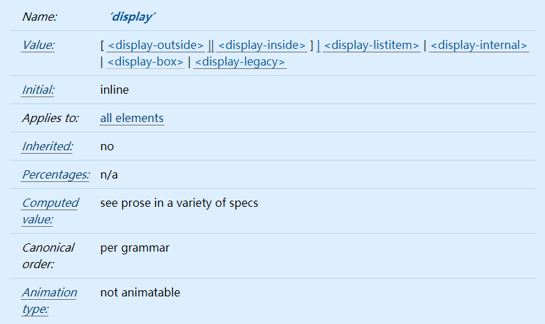
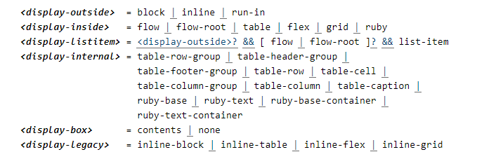
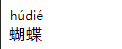

# CSS display的多种写法

本文将介绍如何通过定义display属性创建一个 CSS formatting box 

## display属性值
先来看标准文档是怎么描述的吧

从大的分类来讲，display可以分为6个大类:


## display-outside
所谓display-outside，就是说这些值只会直接影响一个元素的外部表现，而不影响元素里面的儿子级孙子级元素的表现。

`display: block`：定义最基本的block-level 

`display: inline`：定义最基本的的inline-level

`display: run-in`： 会根据后面的元素进行转换display为inline | inlin-block | block。 如果它后一个元素是block，那么它会变成inline并且神奇的是它会和后一个元素并排。如果它后一个元素是inline那么它会变成block。

不过很遗憾，Chrome从32版本开始将这个属性移除了。想要了解其实现效果，可以参考标准文档 https://www.w3.org/TR/css-display-3/#run-in-layout 

想要了解为什么chrome不支持这个属性，可以阅读 <a href="https://stackoverflow.com/questions/22080141/display-run-in-dropped-in-chrome" target="blank">display-run-in-dropped-in-chrome</a>

## display-inside
display-inside 通俗地讲，主要是用来管束自己下属的儿子级元素的排布的，规定它们的布局。

`display: flow`：处于试验阶段的一个属性值，渲染成哪个盒子与外部元素的显示类型有关。
> If its outer display type is inline or run-in, and it is participating in a block or inline formatting context, then it generates an inline box. Otherwise it generates a block container box.

`display: flow-root`: 可以让元素块状化，同时包含格式化上下文`BFC`，可以用来`清除浮动`，`去除margin合并`，实现`两栏自适应布局`等。
```html
<div class="box">
    
    <p class="flow-root">zhaodao88.com</p>
</div>
<style>
	img {
    	float: left;
    	width: 50px;
    	margin-right: 10px;
	}
	.flow-root {
	    display: flow-root;
	    background-color: #f0f3f9;
	    padding: 10px;
	}
</style>
```


`display: table`: 实现table表格
>The element generates a principal table wrapper box that establishes a block formatting context, and which contains an additionally-generated table grid box that establishes a table formatting context.

`display: flex`: flex布局，相信作为前端工程师，这个属性以及与它相关联的一系列属性一定了然于胸。这里不能详述，关于这个写起来得是一大篇文章，感兴趣可以阅读这篇文章。https://css-tricks.com/snippets/css/a-guide-to-flexbox/

`display: grid`: 网格布局。也是很重要的一个布局，不能详述，关于这个写起来也是一大篇文章。详情还是参考这篇文章，讲得非常细致非常清楚。https://css-tricks.com/snippets/css/complete-guide-grid/

`display: ruby`: 这个就比较好玩了，可以添加类似拼音的效果。感兴趣的可以移步标准文档：https://www.w3.org/TR/css-ruby-1
```html
<ruby>蝴<rt>hú</rt>蝶<rt>dié</rt>
```



## display-listitem

`display: list-item`: 实现列表元素的效果，等同于`<ul><li>`，感兴趣可以阅读我之前写的关于list-model详细描述的两篇文章。
https://blog.csdn.net/wuchen092832/article/details/107525165

https://blog.csdn.net/wuchen092832/article/details/107528054
## display-internal

主要为`display: table-*`, `display: ruby-*`这些属性。

在这里主要讲讲`display: table-cell`： 可以用来实现`大小不固定元素的垂直居中`，`两栏自适应布局`，

+ 垂直居中：
```css
div{
	display:table-cell;
	width:1em; 
	height:1em; 
	border:1px solid #beceeb;
	font-size:144px; 
	text-align:center; 
	vertical-align:middle;
} 
img{
	vertical-align:middle;
}
<div>
	
</div>
```
+ 两栏自适应布局
使用方法等同于上面提到的display: flow-root。

## display-box

`display: contents`: 来看看标准文档对它的定义：
>The element itself does not generate any boxes, but its children and pseudo-elements still generate boxes and text runs as normal. For the purposes of box generation and layout, the element must be treated as if it had been replaced in the element tree by its contents (including both its source-document children and its pseudo-elements, such as ::before and ::after pseudo-elements, which are generated before/after the element’s children as normal).

意思就是：将设置了该属性值的元素本身将不会产生任何盒子，但是它的从保留其子代元素的正常展示。设置了display: contents 的元素本身不会被渲染，但是其子元素能够正常被渲染。

说到这里，细心的你或许已经想到它的应用场景了：我们在写vue组件时，由于框架的要求，在输出的`<template>`里面必须包裹一个父元素，因此组件里面的内容最终都要包裹一层可能没有什么样式的div。从页面渲染上来说，这其实是没有必要的，这个时候，就可以添上`display: contents`，既起到了包裹的作用，但是在实际渲染中，这个 div 其实没有生成任何box。

`display: none`: 
>The element and its descendants generate no boxes or text runs.Similarly, if a text node is defined to behave as display: none, it generates no text runs.

## display-legacy

`display: inline-*`：内联模块。简单理解为在inline里面表示block的特性。


## 参考

https://www.w3.org/TR/css-display-3

https://www.w3.org/TR/css-ruby-1

https://css-tricks.com/snippets/css/complete-guide-grid/

https://css-tricks.com/snippets/css/a-guide-to-flexbox/