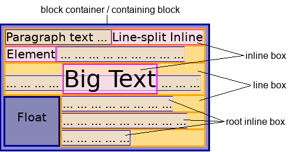

# CSS inline、inline-block

本文将介绍内联布局中，内容的布局方式及相关原理。

## inline box 与 line box

对于行框、内联框，标准文档中有个很经典的图。

附上自己的一段代码，方便理解。
```html
<div style="width: 200px; margin: auto;">
	这是一段代码，又长又好看的代码。
	<span style="color: red">这是inline box</span>
	这又是一段代码，又长又好看的代码。
</div>
```


上图中：蓝色区域代表inline box，表示一个行内的元素框；红色区域代表line box，每一行的区域都可以表示line box；绿色区域代表root inline box，表示行内区域内不被元素包裹的内容，这里表示没有任何元素包裹的文字。

## vertical-align和line-height


