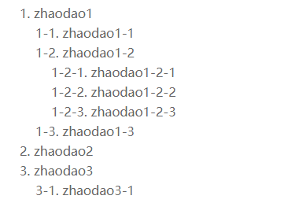

# CSS 列表模型之counter计数器

> 计数器是一种特殊的数字跟踪器，通常用于为CSS列表项自动编号。你可以在项目中通过`counter-increment`、`counter-set`、`counter-reset`来创建一个计数器，并在`counter()/counters()`中使用。

在CSS语法中，需要定义一个`counter-name`作为计数器的唯一标识，这是必不可少的。解析计数器一般有以下几个步骤：

+ 当前计数器从父元素继承而来，遵循父元素的计数规则
+ 通过`counter-reset`实例化一个新的计数器
+ 通过`counter-increment`设置计数器的递增值
+ 通过`counter-set`为计数器设置计数初始值
+ 通过`counter()/counters()`使用计数器

 ## counter-reset
 你可以使用`counter-reset`实例化元素上的新计数器，作用是给这个新计数器起一个名字并附上初始值。`[<counter-name> <integer>]`中`<counter-name>`就是计数器名字，`<integer>`为初始化，初始值默认为0。下面是常用的两个例子：
 ```css
 h1 { counter-reset: zhaodao } /* 计数器名称'zhaodao' */
 h1 { counter-reset: zhaodao 99 } /* 计数器名称'zhaodao', 并附初值99 */
 ```
 你也可以给初值设置负数或者小数，不过设置小数时，比如2.99，在IE和Firefox中无法识别，会当做0处理；在Chrome下向下取整，当成2处理。你也可以利用它给多个计数器同时命名。
 ```css
 H1 { counter-reset: zhaodao -1 zhaodaom 99 }
 ```
 ` counter-set 用法与 counter-reset 一样，这里不做解释，如果你感兴趣，可以移步https://www.w3.org/TR/2020/WD-css-lists-3-20200709 标准文档自行阅读`

 ## counter-increment
你可以使用`counter-increment`为你定义的计数器设置每一次递增的值。计数规则可以简述为：`counter-reset`唯一，每`counter-increment`1次，计数值就加1。你可以像下面的例子一样使用它们。
```css
.counter { counter-reset: zhaodao 2; counter-increment: zhaodao; }
.counter:before { content: counter(zhaodao); }
```
这里值得细说一下，`.counter`作用的第一个元素的计数值显示为3，而不是定义的`zhaodao`初始值2。这是因为`counter-increment`的原因，在渲染第一个元素的时候，`counter-increment`就已经再起作用，使得初始值递增1，最后渲染出来的就是3，而不是2。

## counter()/counters()
你可以使用最简单的组合使用方式：
```css
counter(zhaodao) /* zhaodao就是counter-reset的名称 */
```
基础使用语法`counter(name, style)`，其中`style`在此与`list-style-type`代表一致，表示一种计数的字符形式。比如你可以像下面一样去使用：
```css
counter(zhaodao, lower-roman); /* 以小写罗马数字格式表示当前计数器zhaodao的值 */
```
你还可以使用`counters()`进行级联计数，使用语法`counter(name, string)`，其中`string`为字符串，必须值，代表计数序号的连接字符串。可以实现类似`1-1,1-2`的效果，其中的`strting`为`-`。
```html
<style>
  .reset { padding-left: 20px; counter-reset: zhaodao; line-height: 1.6; color: #666; }
  .counter:before { content: counters(zhaodao, '-') '. '; counter-increment: zhaodao; }
</style>

<div class="reset">
    <div class="counter">zhaodao1
        <div class="reset">
            <div class="counter">zhaodao1-1</div>
            <div class="counter">zhaodao1-2
                <div class="reset">
                    <div class="counter">zhaodao1-2-1</div>
                    <div class="counter">zhaodao1-2-2</div>
                    <div class="counter">zhaodao1-2-3</div>
                </div>
            </div>
            <div class="counter">zhaodao1-3</div>
        </div>
    </div>
    <div class="counter">zhaodao2</div>
    <div class="counter">zhaodao3
        <div class="reset">
            <div class="counter">zhaodao3-1</div>
        </div>
    </div>
</div>
```
效果如下：



## list-item与counter()
列表项在定义的时候，会自动添加`counter()`计数器，就算你没有在样式表中使用`counter`，列表也会自动递增序号，而且与之相关的`counter-increment`等属性都会取默认值。

你可以通过`li { counter-increment: list-item 2; }`去改变列表项递增值为2，也可以通过`li { counter-increment: list-item 0; }`去关闭列表项的递增。

当然你可以像下面一样去定义列表项的递增序号值：
