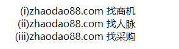
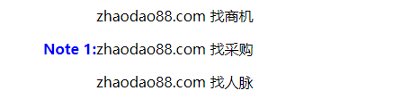

# CSS 列表模型之marker标记
> 本文主要对`::master`伪元素、`list-item`下的`list-style-image`、`list-style-type`样式属性进行介绍，并介绍了在实际中如何使用。`list-item`下还有其他不常用的样式属性这里不做介绍。感兴趣的可以自行移步<a href="https://www.w3.org/TR/2020/WD-css-lists-3-20200709" target="_blank">CSS 标准文档</a>

## `::marker` 是什么

`::marker`是一个标记伪元素，能够定义内容填充在`list-item`上代表列表项的标志，先附上一个例子，就能很清楚地看出它的作用。

```html
<style>
li::marker { content: "(" counter(list-item) ")"; }
li { display: list-item; }
</style>

<ul>
  <li>zhaodao88.com 找商机</li>
  <li>zhaodao88.com 找人脉</li>
  <li>zhaodao88.com 找采购</li>
</ul>
```
效果图：



在这里，`marker`为元素定义的是每一项列表项前面的标记符，在伪元素内的`content`的内容就是要在列表项前面所填充的内容。

##  使用`::marker`填充标记内容

需要注意的是，普通元素要想使用`marker`，必须将元素定义成`display: list-item`，`list-items`在创建的时候会自动生成`marker`和`counter`。

标记的样式可以使用`list-style-type`和 `list-style-image`属性或者直接使用`::marker`伪元素进行样式编写。下面展示一个例子。
+ 用`::marker`伪元素对标记进行控制，伪元素内`content`的内容就是标记符的内容
```html
<style>
  p { margin-left: 12 em; }
  p.note {
    display: list-item;
    counter-increment: note-counter;
  }
  p.note::marker {
    content: "Note " counter(note-counter) ":";
    color: blue;
    font-weight: bold;
  }
</style>
<p>zhaodao88.com 找商机</p>
<p class="note">zhaodao88.com 找采购</p>
<p>zhaodao88.com 找人脉</p>
```
效果如图:



当然也可以为标记设置字体样式、颜色等属性，类似上面效果`li::marker { color: blue; font-weight:bold; }`
> 值得注意的是：目前只有以下属性能够作用于`marker`伪元素上
> + 所有的字体样式：`font`相关
> + `white-space`属性
> + `color`属性
> + `text-combine-upright`, `unicode-bidi`, `direction`属性
> + `content`属性
> + 所有的`animation`和`transition`属性


有*issue*提出，在标记使用`white-space: pre`可能不会有很好的效果，可以尝试`text-space-collapse: preserve-spaces`和`text-space-trim: discard-after`一起使用，更能达到想要的效果，感兴趣的请移步 <a href="https://github.com/w3c/csswg-drafts/issues/4448" target="_blank">*issue 4448*</a>和<a href="https://github.com/w3c/csswg-drafts/issues/4891" target="_blank">*issue 4891*</a>

## 使用`list-style-image`图像填充标记内容
指定标记图像，当列表项内容正常时，用指定图像填充列表项的标记。
> `list-style-image` 正常取值 `<image> | none`，未定义情况下是 `none`，作用在列表项`list-items`下。其中`<image>`用于指定标记图像的`url`。<a href="https://www.w3.org/TR/2020/WD-css-lists-3-20200709/#propdef-list-style-image" target="_blank">参考链接移步</a>

下面是使用例子，将会为`<li>`标签的标记块填充上指定链接的`ellipse.png`图像

```css
li { list-style-image: url("http://www.example.com/ellipse.png") }
```
## 使用`list-style-type`文本类型填充标记内容
指定标记字符串，当列表项内容正常时，用指定字符串填充列表项的标记。
> `list-style-type` 正常取值 `<counter-style> | <string> | none`，未定义情况下是 `disc(圆形标记符)`，作用在列表项`list-items`下。<a href="https://www.w3.org/TR/2020/WD-css-lists-3-20200709/#propdef-list-style-type" target="_blank">参考链接移步</a>
> 
> `<counter-style>`是CSS 定义的计数器样式，允许开发者自定义`counter`的样式。比如：
> ```css
> @counter-style thumbs {
>  system: cyclic;
>  symbols: "\1F44D";
>  suffix: " ";
>}
>
>ul {
>   list-style-type: thumbs;
>}
> ```
> 具体`<counter-style>`定义规则<a href="https://www.w3.org/TR/css-counter-styles-3/#typedef-counter-style" target="_blank">参考</a>

下面是关于`list-style-type`的使用例子(*如果作用元素不是列表元素，则元素的display必须设置为list-item*)
```css
ul { list-style-type: "★"; } // 使用"★"作为标记符

p.note { // 如果作用元素不是列表元素，则元素的display必须设置为list-item
  display: list-item;
  list-style-type: "Note: ";
  list-style-position: inside;
}

ol { list-style-type: upper-roman; } // 定义为罗马数字的大写形式

ul { list-style-type: symbols(cyclic '○' '●'); } // 标记符在'○'和'●'之间切换

ul { list-style-type: none; } // 不显示标记
```

## 注意
`::marker`伪元素标记不是所有浏览器都支持，包括`chrome`也只是在80以上版本通过启用`experimental Web Platform`才支持，如果你想要测试效果，请前往`chrome://flags`启用`experimental Web Platform`。并不推荐在实际项目去使用这条规则，更推荐使用常规的做法去设置标记块样式。

## 总结

列表在前端项目中很常见，应用场景也十分广泛。个人觉得，`::marker`伪元素是对`list-style-image`和`list-style-text`的补充，三者都是定义标记块的填充内容，`image`注重图像，`text`注重字符串，`::marker`则可以定`font`、`color`等样式，各具特色。

## 参考

https://www.w3.org/TR/2020/WD-css-lists-3-20200709<br>
https://developer.mozilla.org/en-US/docs/Web/CSS/::marker

