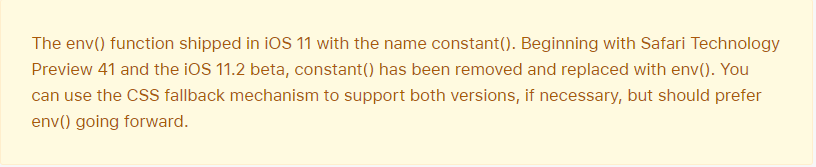

# 为iphoneX设计网站适配

几乎所有的前端开发者都会接触到为iphoneX设计H5网页，其中就得为其特有的安全区域做出适配，以便优化用户体验。

## 安全区域
布局参考线定义了矩形区域，这些区域实际上不会出现在屏幕上，但有助于内容的定位、对齐和间距。这块区域就是安全区域，安全区域还可以防止内容在状态栏、导航栏、工具栏和选项卡栏的下方重叠，如下图蓝色区域：


## Safari 原生网页
Safari在新款iPhone X已经很好地适配了安全区域，你的H5网页在Safari打开是会在安全区域内的。如果你想要在Safari之外的浏览器打开你的H5网页，就得重新考虑一下安全区域的适配了。

## 如何设计

### viweport-fit:cover
viewport fit的默认值是auto，这将导致自动插入行为。为了禁用该行为并使页面布局为屏幕的最大尺寸，可以将viewport fit设置为cover

```html 
<meta name='viewport' content='initial-scale=1, viewport-fit=cover'>
```

### 限制到安全区域
在设置了viewport fit之后，就需要将内容限定在安全区域之内。ios 11 Webkit提出了env()函数，用于设定安全区域与边界的距离，包括四个预定义的变量：
+ safe-area-inset-left：安全区域距离左边边界距离
+ safe-area-inset-right：安全区域距离右边边界距离
+ safe-area-inset-top：安全区域距离顶部边界距离
+ safe-area-inset-bottom：安全区域距离底部边界距离

> 注意：当 viewport-fit=contain 时 env() 是不起作用的，必须要配合 viewport-fit=cover 使用。对于不支持env() 的浏览器，浏览器将会忽略它。

尤其注意很多小伙伴可能会想过使用constant()函数，在官方文档中指出：

因此 constant() 在 iOS11.2之后就不能再使用了，这方面还需要做一下兼容：
```css
.post {
    padding: 12px;
    padding-bottom: constant(safe-area-inset-bottom);  /* 兼容 iOS < 11.2 */
    padding-bottom: env(safe-area-inset-bottom); /* 兼容 iOS >= 11.2 */
}
```
### min()、max()、calc()
实际开发中，可没这么简单。设备横屏竖屏的状态都会导致safe-area-inset-bottom的对象不一致，这时候设置的值就会有问题。你就可以考虑使用数学计算了。。。
```css
.post {
    padding-bottom: max(12px, env(safe-area-inset-bottom));
}
```
在上面例子中：当设备竖屏是，拥有safe-area-inset-bottom，这时候基本上会大于12px，因此取值safe-area-inset-bottom；当横屏时，safe-area-inset-bottom为0，这时候会取默认12px，以致于横屏时页面底部不会太贴边。

你也可以使用calc()计算，不管safe-area-inset-bottom有没有，都设置12px的默认值。如下：
```css
.post {
    padding-bottom:  calc(12px(默认值) + env(safe-area-inset-bottom));
}
```

### @supports
如果你只是希望这种适配只针对iphoneX设备，那么你可以使用 @supports来对适配样式进行隔离。
```css
@supports (bottom: constant(safe-area-inset-bottom)) or (bottom: env(safe-area-inset-bottom)) {
.post {
padding-bottom: constant(safe-area-inset-bottom);
padding-bottom: env(safe-area-inset-bottom);
}
}
```

## 写在最后
以上几种方案仅供参考，有兴趣对iphone设备兼容的可以移步官方文档（底部参考链接）进行研究。

## 参考

https://developer.apple.com/design/human-interface-guidelines/ios/visual-design/adaptivity-and-layout/

https://webkit.org/blog/7929/designing-websites-for-iphone-x/