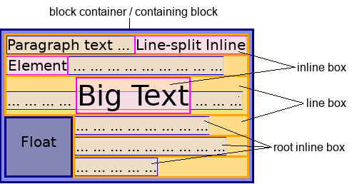
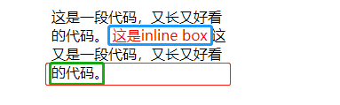
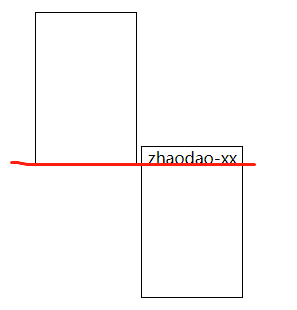
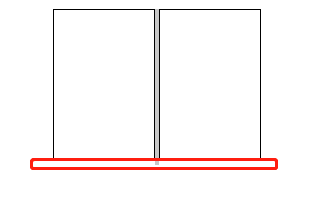

# CSS inline、inline-block

本文将介绍内联布局中，内容的布局方式及相关原理。

## inline box 与 line box

对于行框、内联框，标准文档中有个很经典的图。

附上自己的一段代码，方便理解。
```html
<div style="width: 200px; margin: auto;">
	这是一段代码，又长又好看的代码。
	<span style="color: red">这是inline box</span>
	这又是一段代码，又长又好看的代码。
</div>
```


上图中：蓝色区域代表inline box，表示一个行内的元素框；红色区域代表line box，每一行的区域都可以表示line box；绿色区域代表root inline box，表示行内区域内不被元素包裹的内容，这里表示没有任何元素包裹的文字。

## baseline基线
在内联模型中，涉及到垂直方向的对齐，都离不开基线的定义。我们通常所说的基线：就是英文字母'x'的下边缘线。(如下图baseline红线)


其中涉及到一个概念叫做“x-height”，所指的就是字母'x'的高度。也就是median(中线)与基线之间的距离。

值得注意的是，最常见的`vertical-align: middle`，所指示的位置不是median，而是1/2 `x-height`的高度。

对于inline-block元素来说，它的基线取决于元素本身的特性，在该元素中没有行内子元素（注意是DOM树的子元素，有块子元素不算或者块子元素中有行元素这个行元素算）的时候或者overflow不为visible，该inline-block的基线为margin-bottom的下边界。否则，以该元素中最后一个行框子元素的基线为该元素的基线。

如下图：第一个inline-block元素没有行内子元素，它的基线为margin-bottom的下边界；第二个有行内元素（内容），基线以x字母正常基线。vertical-align默认以baseline基线对齐，出现下图效果。



而当两个inline-block都没有行内元素时，就会出现另外一种结果了，如下图所示：



## vertical-align

line-height行高的定义就是两基线的间距；vertical-align的默认值就是基线。这两者之间有着密切的关系。

只有一个元素属于inline或是inline-block，vertical-align才会起作用。

这里需要引申另外一个概念：行替换元素。替换元素就是浏览器根据元素的标签和属性，来决定元素的具体显示内容。行替换元素即：浏览器显示的内容，在通过控制台审查元素时，看不到实际内容的行内元素。比如图片，呈现出来就是对应src的图片，但是审查元素下只有标签，看不到图片（只有一个url）。

行替换元素在实际中会产生出现一段空白的问题，如下图所示：


其实这种情况跟上面两个inline-block的情况一样，本质上，是vertical-align和line-height一起产生的影响，那么有什么方法解决呢？
+ 方法一： 让vertical-align失效

前面也说了，vertical-align对块级元素无感，所以当没有后面的'zhaodao88.com'文字时，只要让图片display设置为block就可以了。
```css
img { display: block; }
```
+ 使用其他vertical-align值`（适合后面有跟文字的场景）`

只要不是默认值: baseline，其他都是可以的:bottom...

+ font-size控制line-height`（适合后面没有跟文字的场景，毕竟font-size会影响字体大小）`

下面的空隙高度，实际上是文字计算后的行高值和字母x下边缘的距离。因此，只要行高足够小，实际文字占据的高度的底部就会在x的上面，下面没有了高度区域支撑，自然，图片就会有容器底边贴合在一起了。而line-height又受到font-size的影响，因此只需要在父元素上将font-size设置为0就可。
```css
div { font-size: 0; }
```


## 垂直居中

如果想要垂直居中，第一反应利用vertical-align: middle来实现。啪啪啪一段代码来看看效果
```css
div { line-height: 85px; }
img { vertical-align: middle; }
```

这就是传说中的居中吗？上下间距相差太大了吧？！！
毫无疑问，这又是vertical_align和line-height搞的鬼。

因为middle是相对于x字符的中心点来说的，而实际上字符内容区域是并不是x的高度（比方说图上的h就比x高出一截）就是这一截导致了这种情况。

因此，要想完全垂直居中，回顾上面消除空白段的方法。

1、可以使用设置font-size: 0的方式`（适合后面没有跟文字的场景，毕竟font-size会影响字体大小）`来实现真正意义上的垂直居中。

2、如果既要消除图片跟文字之间的空隙，又要跟文字，那么文字可以使用一个行内标签包裹：
```html
<style>
div {
	background-color: #cccccc;
	margin: 100px 300px 0;
	line-height: 85px;
	height: 85px;
	font-size: 0;
}
img {
	vertical-align: middle;
}
span {
	vertical-align: middle;
	font-size: 16px;
}
</style>
<div>
	<span style="background-color: #ffffff">zhaodao88.com</span>
</div>
```
3、使用一个空的行内标签。将空标签的line-height设为div的高度。
```html
<style>
	div {
		background-color: #cccccc;
		margin: 100px 300px 0;
		height: 85px;
		font-size: 0;
	}
	img {
		vertical-align: middle;
	}
	span {
		vertical-align: middle;
		font-size: 16px;
	}
	.none {
		line-height: 85px;
	}
</style>
<div>
	<span style="background-color: #ffffff">zhaodao88.com</span>
	<span class="none"></span>
</div>
```


## 参考

https://www.w3.org/TR/2020/WD-css-inline-3-20200618

https://www.zhangxinxu.com/wordpress/2015/08/css-deep-understand-vertical-align-and-line-height