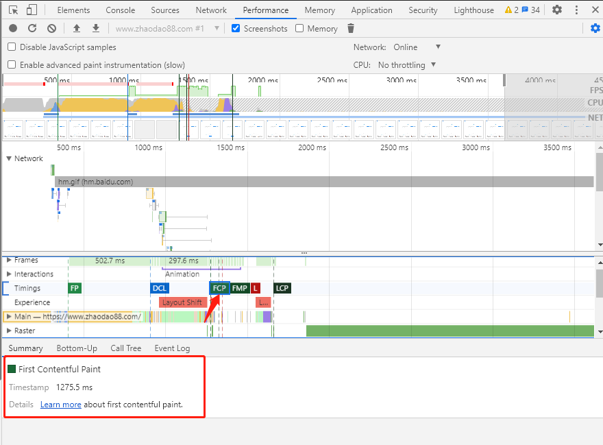
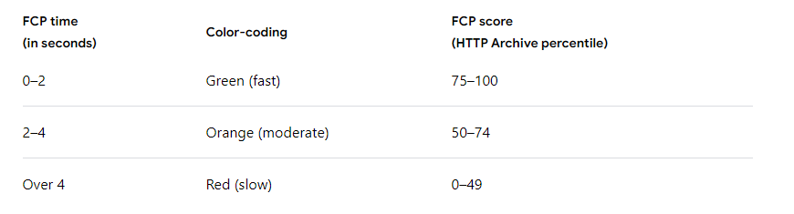
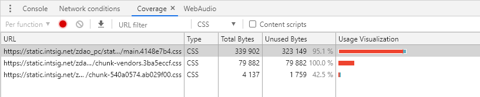

# CSS 优化策略之延迟加载非关键CSS

> CSS文件是render-blocking resources,必须在浏览器呈现页面之前加载和处理它们,包含不必要的大样式的网页需要更长的时间才能呈现。

本文将介绍如何同步加载关键样式，而其他样式则以非阻塞方式加载。

## 如何检测你的网站

+ 在Chrome上打开你的网页
+ 调出控制台选择 Performance 项
+ 在 Performance 页面点击 Reload 分析



在分析结果中，浏览器需要等待所有CSS加载并得到处理，然后才能在屏幕上绘制一个像素。

你可以通过 FCP(First Contentful Paint) 的时间来判断你的性能，FCP表示从开始导航到浏览器呈现第一段DOM内容所需的时间。具体的定义如下：




## 如何分析非关键代码

优化之前，你需要知道你的CSS样式代码哪些是关键的，哪些是不关键的，这个时候可以借助 Coverage Tool 来分析你的CSS代码。



选择报告中的CSS文件，会看到有两种颜色的标志：
+ 绿色：表示关键代码，初始页面展示所要用的样式代码。
+ 红色：表示非关键代码，比如鼠标hover之后的一些CSS效果。

有了这份报告，你就可以整理出非关键CSS代码。

## 如何优化

有了上面的分析报告，就可以设置延迟加载非关键CSS。

比方说下面例子：（styles.css里是非关键CSS代码）
```html
<link rel="preload" href="styles.css" as="style" onload="this.onload=null;this.rel='stylesheet'">
<noscript><link rel="stylesheet" href="styles.css"></noscript>
```
主要原理如下：
+ `link rel="preload" as="style"`异步请求样式表（详情可见<a href="https://web.dev/preload-critical-assets/?utm_source=devtools" target="blank"> Preload critical assets guide</a>）
+ `onload`属性允许CSS在加载完成之后执行一些处理，在这里执行null转化，可以避免在切换rel属性时重复处理
+ `noscript`元素对不支持javascript的浏览器做兼容。

> 在实际生产环境中，你可以通过 <a href="https://github.com/filamentgroup/loadCSS/blob/master/README.md" target="blank"> loadCSS</a> 函数来很好地进行优化

## 利用webpack插件

###  HTML Critical Webpack Plugin

```javascript
const HtmlCriticalPlugin = require("html-critical-webpack-plugin");

module.export = {
  mode: 'production',
  plugins: [
    new HtmlCriticalPlugin({
      base: path.join(path.resolve(__dirname), 'dist/'),
      src: 'index.html',
      dest: 'index.html',
      inline: true,
      minify: true,
      extract: true,
      width: 375,
      height: 565,
      penthouse: {
        blockJSRequests: false,
      }
    })
  ] 
};
```

## 参考

https://web.dev/defer-non-critical-css/

https://web.dev/discover-performance-opportunities-with-lighthouse/#run-lighthouse-from-chrome-devtools

https://web.dev/first-contentful-paint/

https://vuejsdevelopers.com/2017/07/24/critical-css-webpack/

https://github.com/anthonygore/html-critical-webpack-plugin